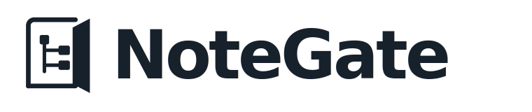
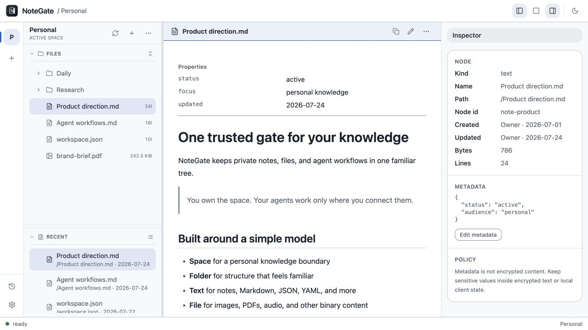
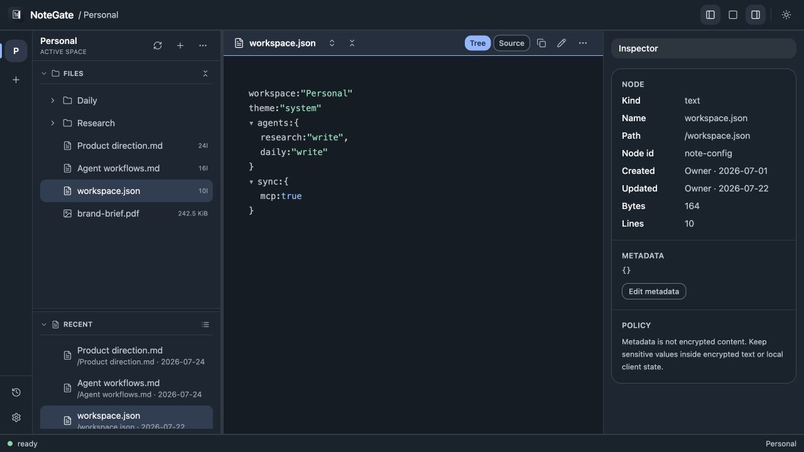
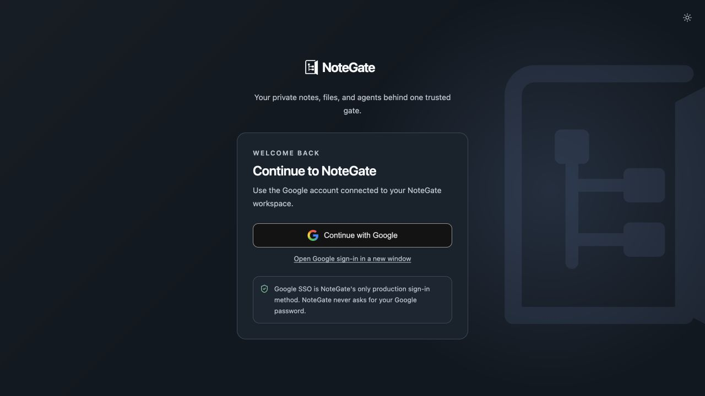

<p align="center">
  <picture>
    <source media="(prefers-color-scheme: dark)" srcset="frontend/web/public/brand/svg/logo-horizontal-dark.svg">
    <source media="(prefers-color-scheme: light)" srcset="frontend/web/public/brand/svg/logo-horizontal-light.svg">
    
  </picture>
</p>

<p align="center">
  <strong>Your private notes, files, and agents behind one trusted gate.</strong><br>
  An open-source personal file space where you and trusted AI agents work from the same tree.
</p>



## What is NoteGate?

NoteGate is a personal storage boundary for knowledge shared between a person and their AI agents. You manage a familiar file tree in the web app; connected agents use the same `Space / Folder / Text / File` model through MCP and REST.

- Keep Markdown, JSON, YAML, plain text, images, PDFs, and other files together.
- Read, edit, preview, search, and transfer content without maintaining a second agent-only store.
- Give each user-managed agent read or write access only to the spaces it needs.
- Sign in to the browser with Google SSO. REST and MCP access use bearer credentials.
- Work across responsive light and dark interfaces.

## Screens

<table>
  <tr>
    <td width="50%"></td>
    <td width="50%"></td>
  </tr>
  <tr>
    <td align="center">Structured text and file-tree workbench</td>
    <td align="center">Google-only production sign-in</td>
  </tr>
</table>

## Run locally

Requirements: Docker, Rust, Node.js, and pnpm.

```sh
cp .env.example .env
pnpm install
make dev-infra
```

Then run the API and dashboard in separate terminals:

```sh
cargo run --bin notegate-api
pnpm web:dev
```

Open [http://localhost:5173](http://localhost:5173). For the production-like Docker stack, run `make up` and open [http://localhost:9191](http://localhost:9191).

See the [development guide](docs/development.md) for architecture, configuration, service URLs, and checks.

## Documentation

- [Product model](docs/adr/0001-ai-native-personal-file-space.md)
- [Agent and permission model](docs/adr/0002-user-managed-agents-and-space-connections.md)
- [MCP tools](docs/spec/mcp/README.md)
- [UI design source of truth](DESIGN.md)
- [Security model](docs/spec/security.md)

## Project status

NoteGate is open source under [AGPL-3.0-or-later](LICENSE) and is primarily maintained by one developer. The project is actively evolving; focused issues and real-world feedback are welcome.
